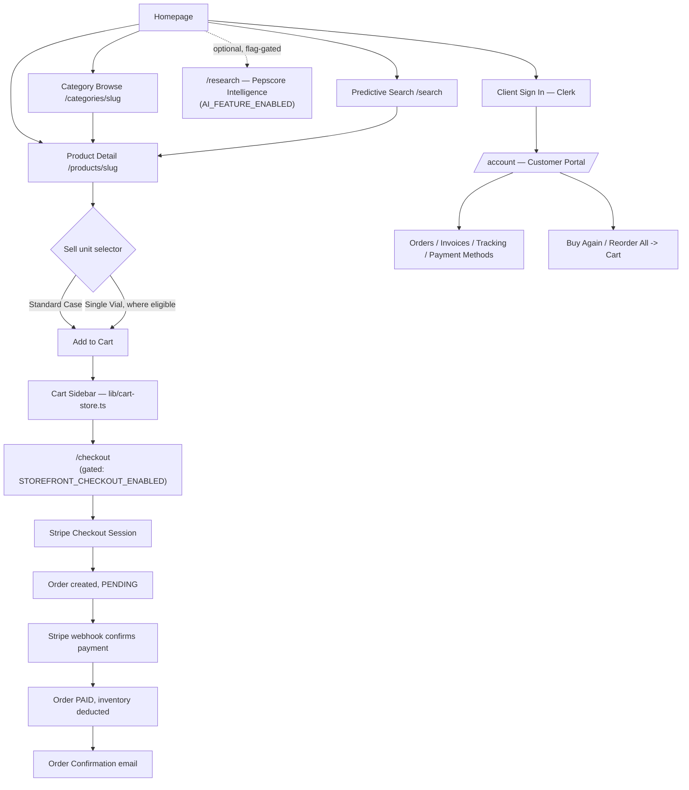
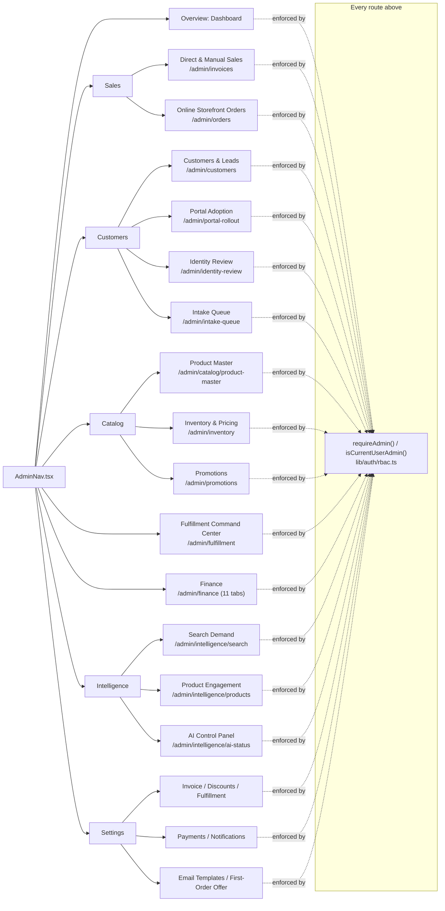
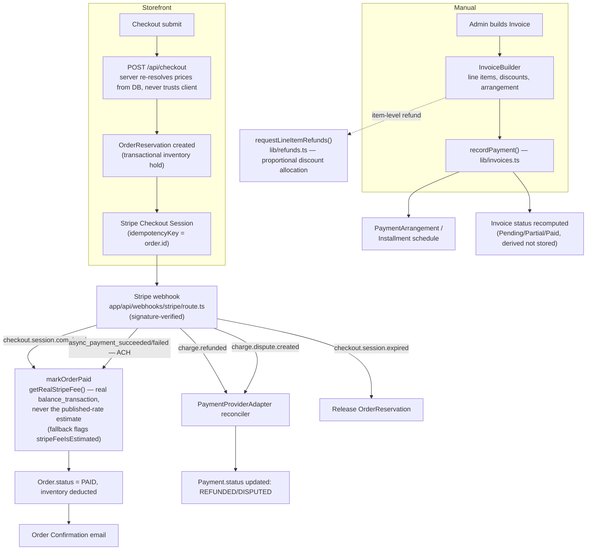
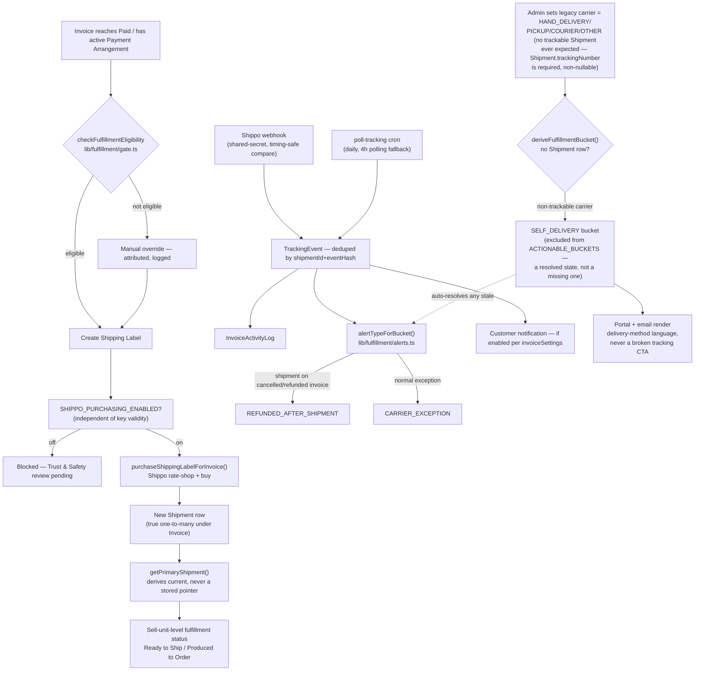
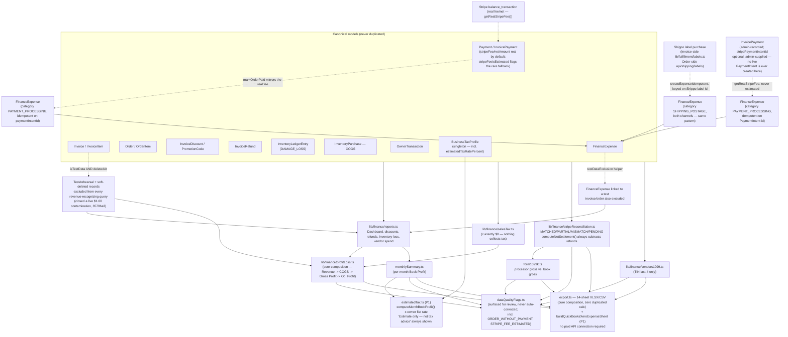
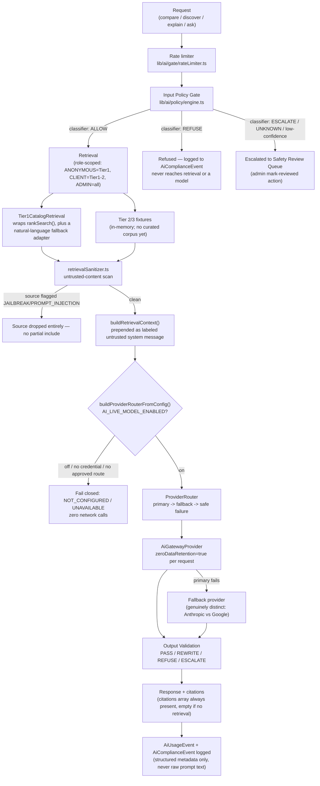
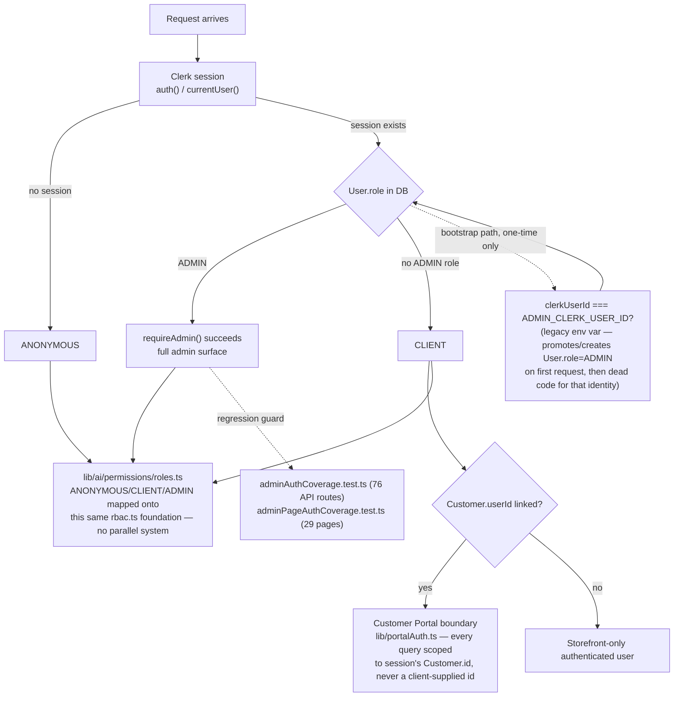
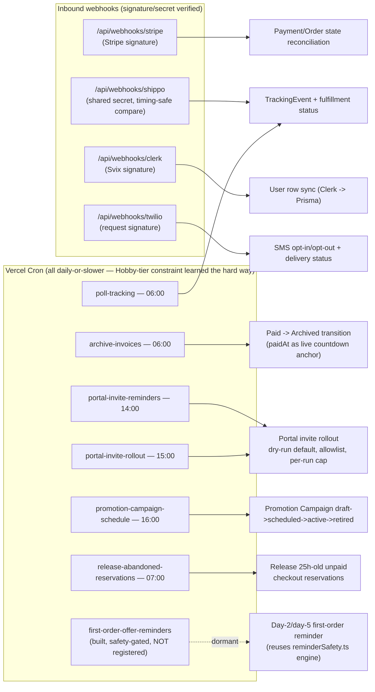
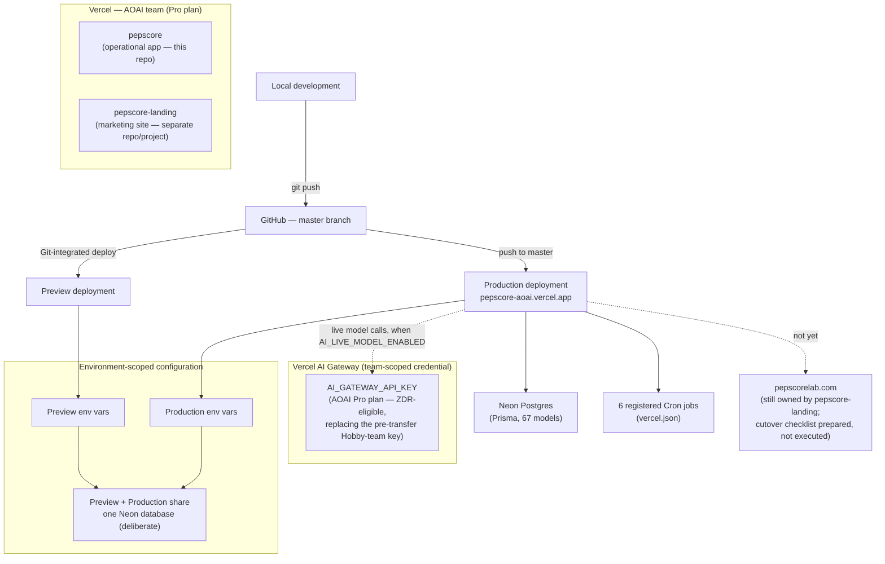
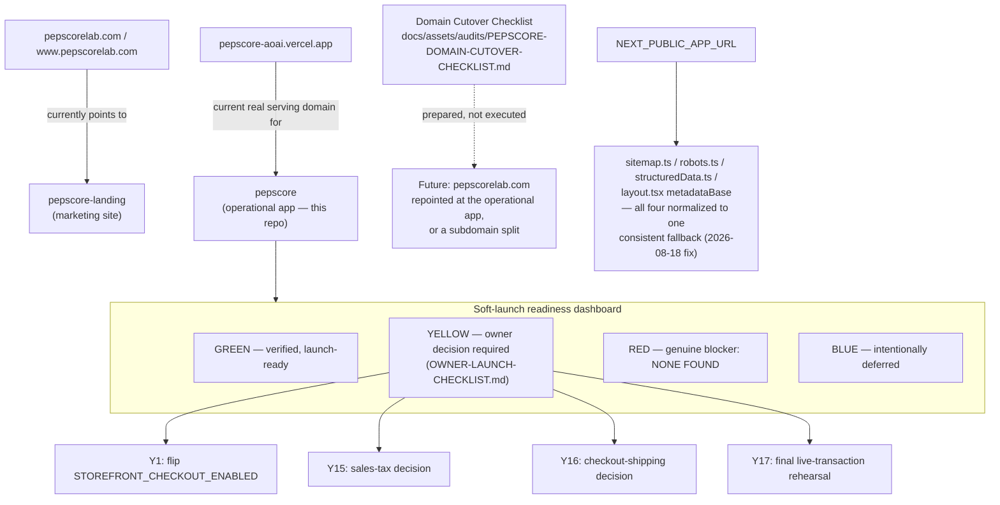

# Pepscore Lab — Architecture Diagrams

Companion to `docs/Architecture.md` (invoice-module-scoped) and `docs/CaseStudy.md` (full narrative history). This document holds system-level Mermaid diagrams for the ten flows tracked as a standing documentation requirement. Every node and edge below is grounded in real route paths, real function/model names, and real file locations as of commit `13ebf90` (diagrams 3 and 5 updated 2026-08-19: the Finance P1 sprint, the P0 verification pass's `deletedAt` fix, and the Stripe fee-reconciliation hardening pass — real balance-transaction fees, the `computeNetSettlement()` refund-bug fix, and the `markOrderPaid → FinanceExpense` bridge; all other diagrams unchanged since `72a5baf` — none of this work altered the Customer Journey, Admin Operating System, Fulfillment, AI Intelligence, Auth/RBAC, Webhook/Automation, Deployment, or Domain/Launch flows) — see the file path noted under each diagram for where to verify it directly. This is a living document: extend it, don't replace it, whenever a diagrammed flow changes materially.

---

## 1. Customer Journey

Grounded in: `app/page.tsx`, `app/products/[slug]/page.tsx`, `app/categories/[slug]/page.tsx`, `app/search/page.tsx`, `app/research/page.tsx`, `app/checkout/page.tsx`, `app/account/**`, `lib/cart-store.ts`.

Notes: `/checkout` and live payment collection are engineering-complete but not publicly activated (`STOREFRONT_CHECKOUT_ENABLED` unset in production) — the diagram reflects the built path, not current activation state. `/research` is similarly flag-gated and returns `notFound()` when `AI_FEATURE_ENABLED` is off.

---

## 2. Admin Operating System

Grounded in: `components/admin/AdminNav.tsx` (the live navigation source of truth), `app/admin/**`.

Notes: 76 admin API routes and 29 admin pages are covered by two independent automated regression tests (`adminAuthCoverage.test.ts`, `adminPageAuthCoverage.test.ts`) that scan for a real `requireAdmin()`/`isCurrentUserAdmin()` call rather than trusting convention.

---

## 3. Commerce / Payment Flow

Grounded in: `app/api/checkout/route.ts`, `lib/paymentProviders/` (`PaymentProviderAdapter`), `app/api/webhooks/stripe/route.ts`, `lib/invoices.ts` (`recordPayment`).

Notes: card, ACH, Cash App Pay, and PayPal route through the same `PaymentProviderAdapter`; storefront checkout activation is a separate switch (`STOREFRONT_CHECKOUT_ENABLED`) from key configuration itself.

---

## 4. Fulfillment Flow

Grounded in: `lib/fulfillment/gate.ts` (`checkFulfillmentEligibility`), `lib/fulfillment/labels.ts`, `lib/fulfillment/commandCenter.ts` (`deriveFulfillmentBucket`), `lib/shipments/primary.ts` (`getPrimaryShipment`), `app/api/webhooks/shippo/route.ts`, `app/api/cron/poll-tracking/route.ts`. Updated 2026-08-19 for the direct-sales/admin parity audit's `SELF_DELIVERY` bucket fix (`351661a`).

---

## 5. Financial Data Flow

Grounded in: `lib/finance/*.ts`, `docs/finance/PEPSCORE-FINANCIAL-ARCHITECTURE.md`. Updated 2026-08-19 for the Finance P1 sprint (`estimatedTax.ts`, the QuickBooks/Xero export sheet), the P0 verification pass's `deletedAt` fix (`600af53`/`fde75da`/`6579ba3`), the Stripe fee-reconciliation hardening pass (`13ebf90`) — real balance-transaction fees, the `computeNetSettlement()` refund-bug fix, and the `markOrderPaid → FinanceExpense` bridge — and the direct-sales parity audit's Order-side shipping-postage bridge and InvoicePayment fee-parity closure (`351661a` and this same-day follow-up).

---

## 6. AI Intelligence Pipeline

Grounded in: `lib/ai/gate/pipeline.ts` (`runAiPipeline`), `lib/ai/policy/`, `lib/ai/retrieval/`, `lib/ai/providers/`, `app/api/ai/intelligence/route.ts`.

---

## 7. Auth / RBAC

Grounded in: `lib/auth/rbac.ts`, `lib/portalAuth.ts` (Customer Portal boundary), `middleware.ts`, `lib/ai/permissions/roles.ts`.

---

## 8. Webhook / Automation Architecture

Grounded in: `app/api/webhooks/*`, `app/api/cron/*`, `vercel.json`.

---

## 9. Deployment / Infrastructure

Grounded in: `docs/launch/PEPSCORE-SOFT-LAUNCH-READINESS.md`, `docs/assets/audits/PEPSCORE-DOMAIN-CUTOVER-CHECKLIST.md`, `vercel.json`, `app/layout.tsx`.

---

## 10. Domain / Launch Architecture

Grounded in: `docs/launch/PEPSCORE-SOFT-LAUNCH-READINESS.md`, `docs/launch/OWNER-LAUNCH-CHECKLIST.md`, `docs/assets/audits/PEPSCORE-DOMAIN-CUTOVER-CHECKLIST.md`.

---

## Maintaining this document

Each diagram cites the real files it was drawn from — when those files change materially, update the diagram in the same sprint, per the standing rule in `docs/CaseStudy.md`'s "Continuous Update Rule." Do not add a node or edge without first confirming it against the cited source; a diagram that looks plausible but wasn't checked against real code is worse than no diagram.
